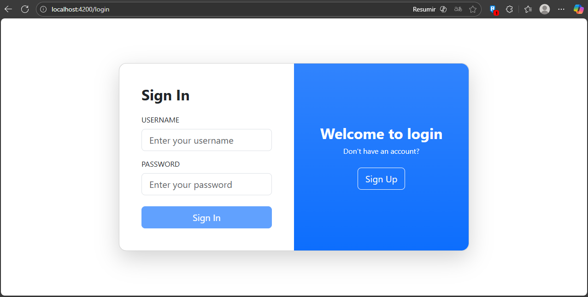
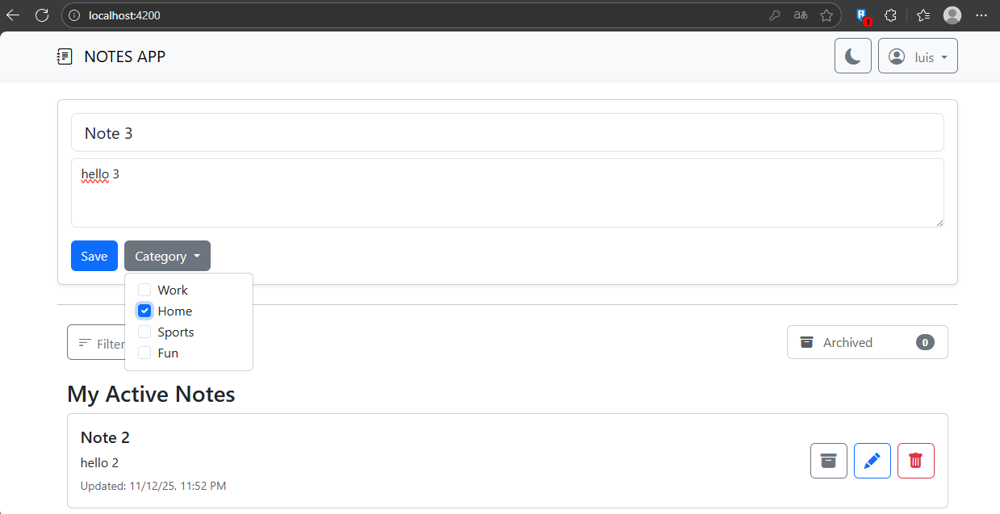
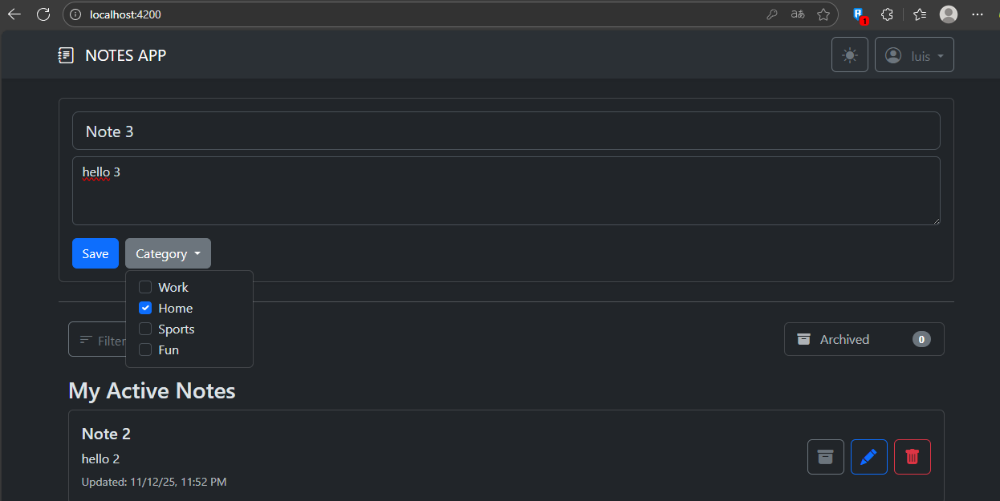

# Full-Stack Notes SPA Challenge

This is a complete Full-Stack SPA (Single Page Application) note-taking application, built to fulfill and exceed the requirements of the technical challenge.

The backend is built with **NestJS**, following a strict layered architecture, and the frontend is a modern, standalone component-based app using **Angular**.

---
## Screenshots

### Login & Signup


### Main Notes App (Light & Dark Mode)



---

## Tech Stack

* **Backend:** NestJS (Node.js, TypeScript)
* **Frontend:** Angular (TypeScript, Standalone Components)
* **Database:** SQLite (Relational)
* **ORM:** TypeORM
* **UI:** Bootstrap / ng-bootstrap
* **Authentication:** JWT (JSON Web Tokens) + Passport.js
* **Security:** Bcrypt password hashing

---

## Features Implemented

This project successfully implements all features from Phase 1, Phase 2, and the Extra Requirements.

### Phase 1 (Complete)
* [X] **Full Note CRUD:** Users can create, read, edit, and delete notes.
* [X] **Archive System:** Users can archive and unarchive notes.
* [X] **View Toggling:** The UI allows toggling between active and archived note lists.

### Phase 2 (Complete)
* [X] **Categories (Tags):** A Many-to-Many relationship between Notes and Categories is fully implemented.
* [X] **Category Assignment:** Users can assign multiple categories when creating or editing a note.
* [X] **Multi-Category Filtering:** The active notes list can be filtered by one or more categories simultaneously.

### Extra Features (Implemented)
* [X] **Full Authentication & Authorization:**
    * The entire application (all API routes for notes/categories) is protected.
    * Users can **Sign Up** with a hashed password (`POST /users`).
    * Users can **Sign In** to receive a JWT (`POST /auth/login`).
    * **Authorization:** The API ensures that users can **only** view, edit, filter, or delete their **own** notes.
* [X] **Database Seeding:**
    * The backend automatically seeds the database with default categories (Work, Home, Sports, Fun) on first launch.
* [X] **Dark Mode:**
    * The frontend includes a UI toggle for a full-application dark/light theme.

---

## Runtimes & Prerequisites

To run this project, you will need:
* **Node.js:** `v18.17.0` (or any `v18+` LTS)
* **npm:** `9.6.7` (or any `v9+`)
* **Angular CLI:** `v18.x.x` (or `v19`)
* **NestJS CLI:** `v10.x.x`

---

## How to Run the Application

### Option 1: The "One-Click" Script (Recommended)

For Linux/macOS or Git Bash on Windows, simply run the included shell script from the root directory:

```bash
./start.sh